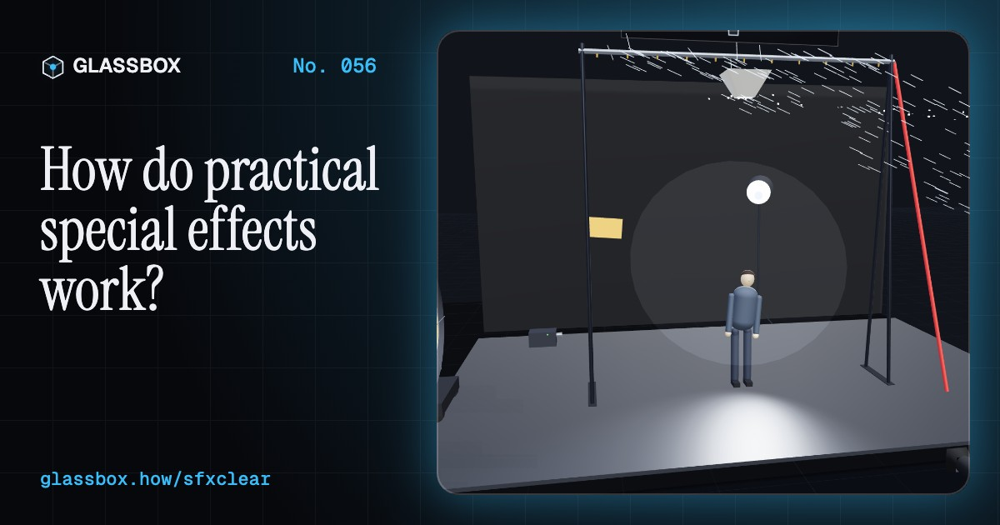
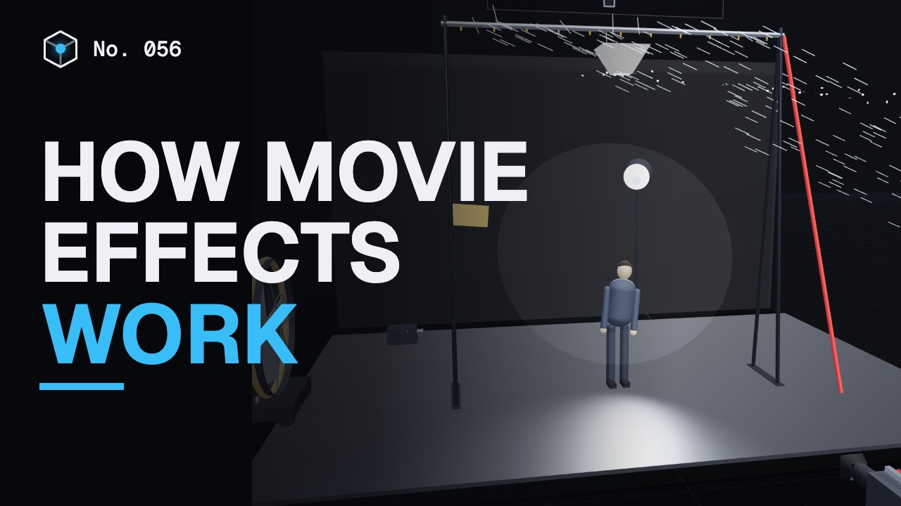
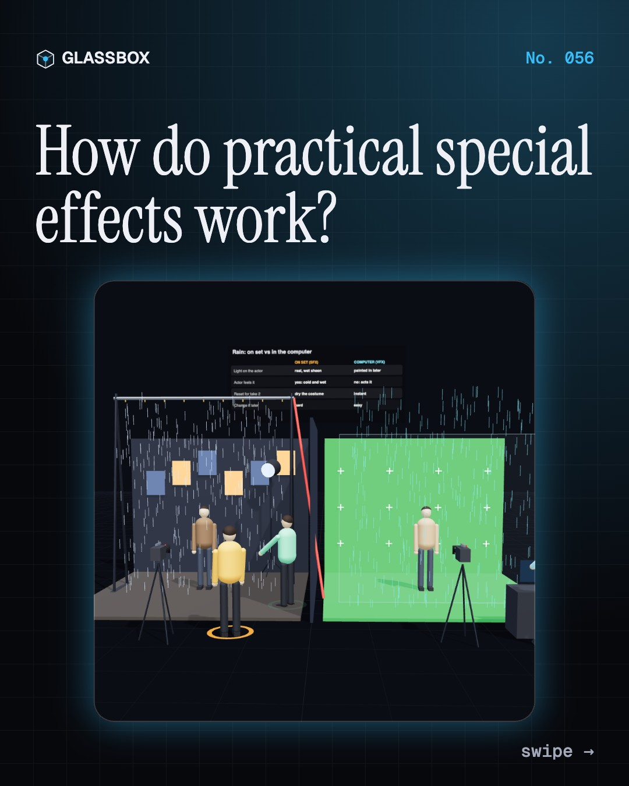
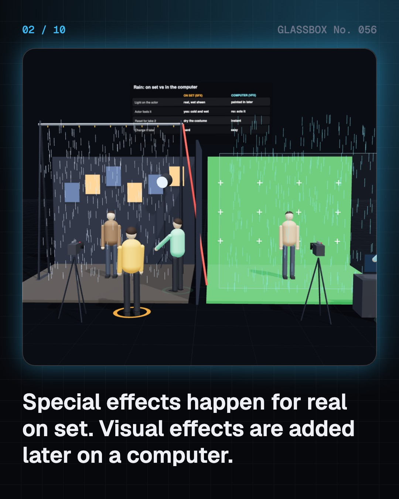
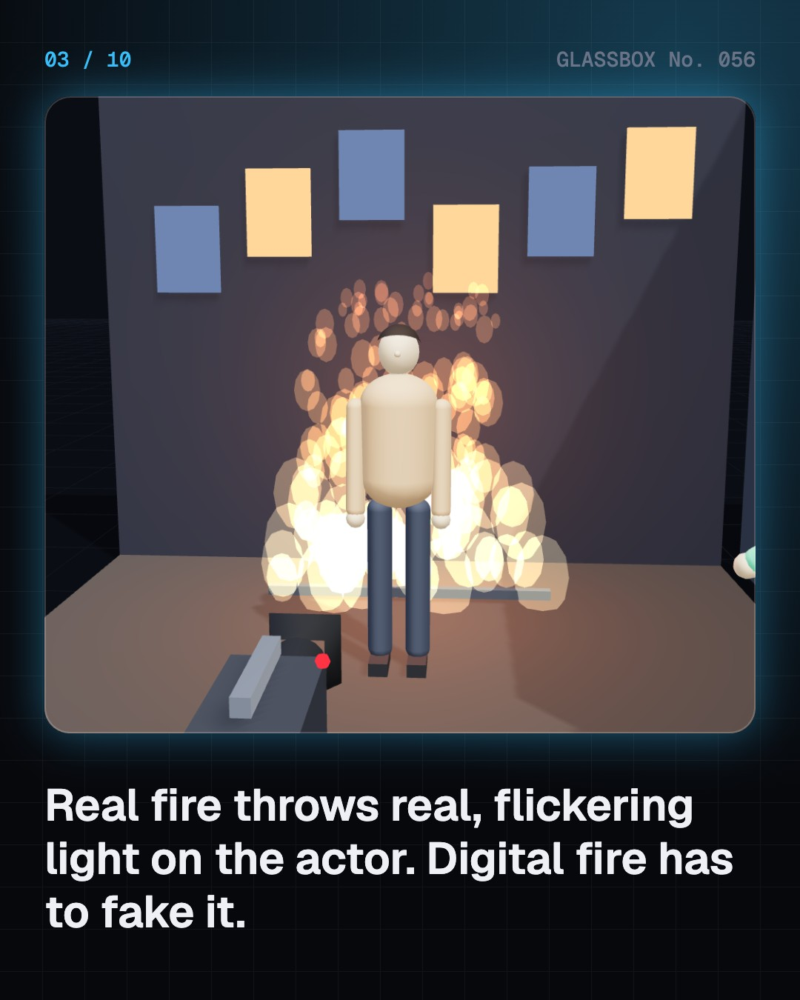
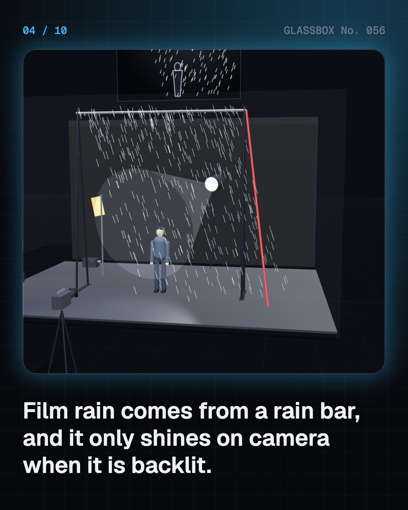

<!-- glassbox:start -->
<!-- Generated from glassbox.json by the Glassbox hub (npm run readme -- sfxclear). Edit glassbox.json, not this block. -->
<p align="center"><a href="https://glassbox.how/e/sfxclear/"></a></p>

<h1 align="center">SFXClear</h1>

<p align="center"><b>How do practical special effects work?</b><br>Film rain is often heavier than a monsoon cloudburst, yet it vanishes on camera unless it is lit from behind. Run a rain bar and a wind machine, shatter a sugar-glass window, fly a performer on a counterweight, drive an animatronic's servos and fire a gas flame bar, safety checklist first.</p>

<p align="center"><a href="https://glassbox.how/sfxclear/"><b>▶ Play with it</b></a> &nbsp;·&nbsp; <a href="https://glassbox.how/e/sfxclear/">Read the 60-second explainer</a> &nbsp;·&nbsp; <a href="https://glassbox.how/sfxclear/glassbox/reel.mp4">Watch the 40-second video</a></p>

<p align="center">
  <a href="https://glassbox.how/e/sfxclear/"></a>
  <a href="https://glassbox.how/e/sfxclear/"></a>
  <a href="LICENSE"></a>
  <a href="LICENSE-CONTENT.md"></a>
  <a href="#privacy"></a>
</p>

## In 60 seconds

1. **SFX vs VFX.** Special effects are real, physical tricks done on set, in front of the camera. Visual effects are added later on computers. Practical effects give real light on faces and real reactions. The SFX department is led by a supervisor, with technicians and a licensed pyrotechnic operator for anything with fire.
2. **Weather on demand.** Rain bars, wind machines, paper snow and hazers make weather on cue. Water drops scatter light mostly forwards, so film rain must be backlit to show, and it is often several times heavier than a 100 mm-an-hour cloudburst. At 15 m/s a wind machine pushes on an actor with about 110 N.
3. **Breakaways.** Sugar glass, resin bottles, balsa chairs and foam rubble look solid but break easily into light, blunt pieces. A 30 cm foam block weighs about 0.8 kg against 65 kg for concrete, so its landing energy (m g h) is 80 times smaller.
4. **Rigs and wires.** Wire flying hangs a harnessed performer over pulleys to a counterweight: a = (M − m) g / (M + m), with wires rated many times the load. Ratchets yank stunt performers onto crash mats, gimbals tilt cars to fake bends, and a rotating room turns with its camera so the actor seems to walk up the walls.
5. **Creatures and make-up.** Animatronics hide servos under foam or silicone skin, driven by puppeteers out of shot with a 1 to 2 ms pulse 50 times a second. Prosthetic make-up goes lifecast, clay sculpt, mould, foam appliance, then glue and paint, and can age an actor by decades.
6. **Fire, safety first.** Film fire is mostly gas burners run by a licensed operator, with rehearsals, a fire marshal, shields and an emergency stop. Radiant heat falls with distance squared. A fireball is fuel burning in open air at metres per second: a huge look with a gentle push, unlike a shock wave.

## Words worth knowing

| Term | Meaning |
|---|---|
| **Special effects (SFX)** | Physical effects created for real on set and captured in camera. |
| **Visual effects (VFX)** | Effects created or added on computers after the shoot. |
| **Backlight** | A light behind the subject shining towards the lens; it makes rain, smoke and hair glow. |
| **Breakaway** | A prop built to break easily and safely, like sugar glass or a balsa chair. |
| **Counterweight** | A weight on the other end of a line that balances or lifts a performer. |
| **Gimbal** | A powered platform that tilts and shakes a set piece such as a car. |
| **Animatronic** | A mechanical puppet moved by servos or cables under a lifelike skin. |
| **Prosthetic appliance** | A soft foam latex or silicone piece glued on to change an actor's face. |
| **Deflagration** | Burning that spreads slower than sound, like a film fireball: bright but gentle. |

## A short history

**130 years of real tricks on real sets, from a dummy swapped mid-shot in 1895 to a real jumbo jet crashed for Tenet.**

- **1895** · A beheading that never happened (Alfred Clark, for the Edison Manufacturing Company, Edison company, New Jersey)
- **1896** · The Vanishing Lady (Georges Méliès; Jehanne d'Alcy, Montreuil-sous-Bois, near Paris)
- **1933** · King Kong climbs the Empire State (Willis H. O'Brien; Marcel Delgado, RKO studios, Los Angeles)
- **1939** · A tornado made of cloth (A. Arnold Gillespie, MGM, MGM studios, Culver City, California)
- **1975** · Bruce the shark breaks down (Bob Mattey, for Steven Spielberg, Martha's Vineyard, Massachusetts)
- **1982** · The first make-up Oscar (Rick Baker, Los Angeles)
- **1993** · A life-size T. rex (Stan Winston Studio, for Steven Spielberg, Universal Studios, California)
- **2015** · Mad Max: Fury Road (George Miller; Colin Gibson; Guy Norris, Namibia)

The full story, with 30 moments, charts, people and 46 sources: [glassbox.how/e/sfxclear/history](https://glassbox.how/e/sfxclear/history/). The data lives in [`history.json`](history.json).

## Video and slides

Made with the Glassbox studio from this box's storyboard (`window.glassbox.director`). Free to reuse under CC BY 4.0.

<a href="https://glassbox.how/sfxclear/glassbox/video.mp4"></a>

<p><a href="glassbox/slide-1.jpg"></a> <a href="glassbox/slide-2.jpg"></a> <a href="glassbox/slide-3.jpg"></a> <a href="glassbox/slide-4.jpg"></a></p>

| File | What | Size |
|---|---|---|
| [`glassbox/reel.mp4`](https://glassbox.how/sfxclear/glassbox/reel.mp4) | Reel / Short, with captions and soundtrack | 1080×1920 |
| [`glassbox/video.mp4`](https://glassbox.how/sfxclear/glassbox/video.mp4) | YouTube video, with captions and soundtrack | 1920×1080 |
| `glassbox/slide-1…10.jpg` | Instagram carousel | 1080×1350 |
| `glassbox/thumb.jpg` | YouTube thumbnail | 1280×720 |
| `glassbox/cover.jpg` | Share card and repo social preview | 1200×630 |
| [`glassbox/history-reel.mp4`](https://glassbox.how/sfxclear/glassbox/history-reel.mp4) | “History in 10 moments” Reel / Short | 1080×1920 |
| `glassbox/history-slide-*.jpg` | History carousel | 1080×1350 |
| `glassbox/post.json` | Post copy and schedule used by the publish kit | |

## Privacy

This box has no accounts and no ads, and it ships its own fonts and libraries. When you run it yourself it sends nothing anywhere. On glassbox.how, the site's `/bar.js` also loads Glassbox's analytics: **Google Analytics** to count visits (it asks first in the EU, UK and Switzerland, and stays off when your browser sends Global Privacy Control or Do Not Track) and **ClickTrust** to detect bots.

It remembers a few things **in your own browser only**, and never sends them anywhere:

| Browser storage key | What it holds |
|---|---|
| `sfxclear.v1` | Which chapters you have opened, your best quiz scores, and sound on or off. |

Exactly what each one sees is at [glassbox.how/privacy](https://glassbox.how/privacy/).

## Licences

- **Code:** [MIT](LICENSE). Use it, change it, ship it.
- **Explanations, text, images and videos** (`glassbox.json`, `glassbox/`): [CC BY 4.0](LICENSE-CONTENT.md). Credit “Glassbox, glassbox.how/e/sfxclear”.
- **Third-party parts** keep their own licences: [three.js](https://threejs.org) (MIT), [Geist, Instrument Serif](https://openfontlicense.org) (SIL OFL 1.1).
- The Glassbox name and logo aren't covered by either licence. See the [terms](https://glassbox.how/terms/).

Found a mistake? [Open an issue](https://github.com/bdeeps/sfxclear/issues). Corrections happen in public.
<!-- glassbox:end -->

## Run it

It's plain HTML, CSS and JavaScript. No build step and no dependencies. Run locally, it contacts no other website.

```bash
python3 -m http.server 8000
```

Three.js and the fonts ship in `vendor/` and `fonts/`, so it also works offline.

Then open http://localhost:8000.

## How it's built

| File | What |
|---|---|
| `index.html`, `css/app.css` | The page and its styles |
| `js/app.js`, `js/stage.js`, `js/ui.js`, `js/kit.js` | The shared Glassbox 3D engine: chapters, 3D stage, controls, quiz, video director |
| `js/chapters/*.js` | One file per chapter: the 3D model, controls, text, key terms, quiz and video scenes |
| `js/sfx.js` | SFXClear's shared parts: chart boards, a generic figure, SFX hardware (truss, lamp, wind machine, rain bar, hazer, camera, crash mat, shield) and a small debris-physics engine |
| `glassbox.json` | Title, question, explainer beats, key terms, browser storage and credits shown on glassbox.how |
| `reel` in each chapter | The storyboard the Glassbox studio records into short videos |
| `glassbox/` | The published video, slides, thumbnail and post copy |
| `fonts/`, `vendor/three/` | Self-hosted Geist and Instrument Serif (SIL OFL 1.1) and three.js (MIT) |
